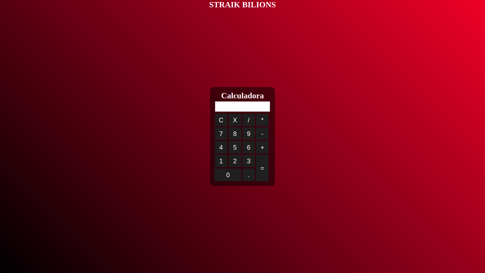

# A Simple Calculator

## Usage:

clone repo to local machine with git clone:
~~~
git clone https://github.com/digitalrobertlima/calculator.git
~~~

double click on calculator.html

## Prints:

### Versão obsoleta:

